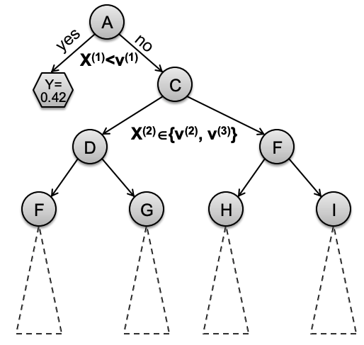
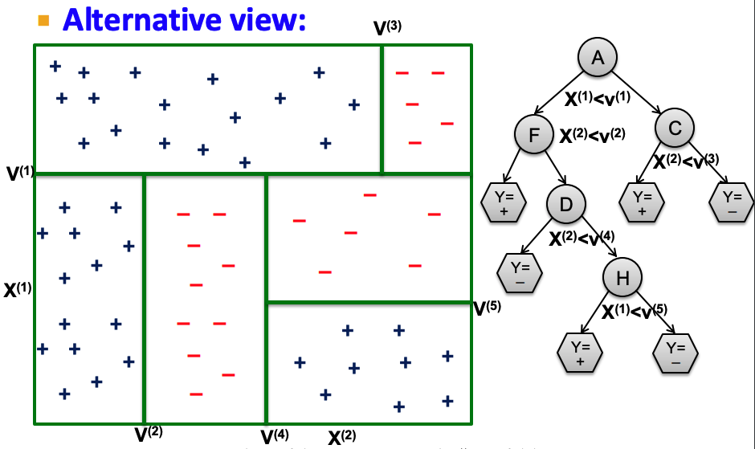
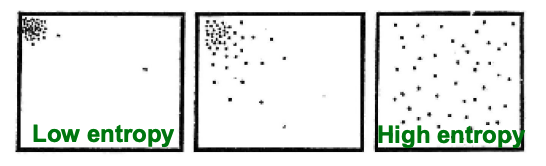
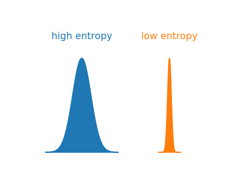
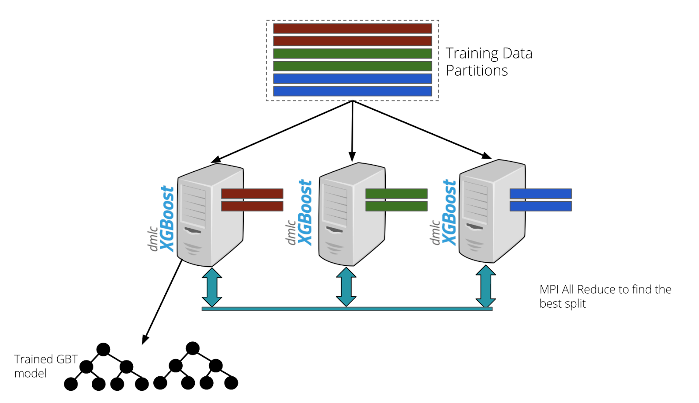

# Decision Trees and Gradient Boosting

We’ll build up the intuition behind Gradient Boosted Decision Trees (GBDTs) like XGBoost.
1. Decision Trees
2. Learning Ensembles
3. AdaBoost
4. Gradient Boosting

# Decision Trees

**Problem setup.**

Given $d$-dimensional data $D = \{x_1, \dots, x_m\} \in \mathbb{R}^d$.

- $x_j^T = \begin{bmatrix} x_j^1 & x_j^2 & \cdots & x_j^d\end{bmatrix}$
- Each feature $x_j^i$ can be categorical or numerical

Labels $Y = \{y_1, \dots, y_m\} \in \mathbb{R}^1$.

**Task:** given vector $x_j$, predict $y_j$.

## Decision tree structure

A decision tree is a **sequence of tests on the attributes** that yields a prediction.



- Non-leaf nodes split the data into two partitions.
- Leaf nodes make a prediction for its partition.

In the feature space:



- Each node is a **linear decision boundary** in the feature space.
- Sequential linear splits → model learns a hyper-rectangular (non-linear!) decision boundary
    - Piecewise-linear function that can model non-linear relationships

Visually, we can see why the **more splits** (greater depth), the **greater risk of overfitting**.

### Algorithm

```python
class Node 
	# attributes: left, right, split, (if leaf node): left_pred, right_pred

def build_subtree(node, partition):
	(node.split, l_partition, r_partition) = find_best_split(partition)
	if stopping_criteria(l_partition):
		node.left_pred = predict(l_partition)
	else:
		build_subtree(node.left, l_partition)
	if stopping_criteria(r_partition):
		node.right_pred = predict(r_partition)
	else:
		build_subtree(node.right, r_partition)
	
	def find_best_split(partition):
		???
	
	def predict(partition):
		???
		
	def stopping_criteria(partition):
		???
```

**Questions:**

1. `stopping_criteria()` - How do we decide if we should stop, or keep splitting?
2. If we keep splitting…
    
    `find_best_split()` - How do we decide the optimal feature to split on?
    
3. If we stop splitting…
    
    `predict()` - How do we make a prediction on a partition of data?
    

### **Finding best feature to split on**

**Regression: Purity score**

Idea - we want each partition of the data after the split to be as homogenous as possible. 

- i.e., if the subsequent partitions have the lowest achievable variance after the split.
- Objective: maximize the relative variance of original dataset compared to partitions

$$
\max_{D_L, D_R}\bigg(|D|\text{var}(D) - \big(|D_L|\text{var}(D_L) + |D_R|\text{var}(D_R)\big)\bigg)
$$

**Classification: Information gain**

Idea - how much does feature $X$ tell us about label $Y$?

Let’s start with some intuition.

1. **Entropy**: $H(X) = -\sum_{x \in \mathcal{X}}\Pr(x)\log \Pr(x)$

For discrete R.V. $X$ with domain $x \in \mathcal{X}$, entropy quantifies the **average uncertainty (a.k.a. information)** associated with the $X$’s possible outcomes.

- High entropy - $X$ is from a highly uniform and random (boring) distribution.
- Low entropy - $X$ is from a concentrated (non-random, low-rank) distribution.





2. **Specific Conditional Entropy: $H(Y|X=v)$**

The entropy of $Y$ among only those samples where $X$ has value $v$.

Example:

$H(Y|X=\text{Math}) = -(0.5 \log_2(0.5) + 0.5\log_2(0.5)) = 1$

$H(Y|X=\text{CS}) = -(1\log(1) + 0\log(0)) = 0$

$H(Y|X=\text{History}) = -(0\log(0) + 1\log(1)) = 0$

This hints at which values don’t tell us much (Math) and which do (CS and History).


3. **Conditional Entropy: $H(Y | X) = \sum_{x \in \mathcal{X}} \Pr(X=x)H(Y|X=x)$**

The average specific conditional entropy of $Y$ for feature $X$.

- i.e., the entropy of $Y$ conditioned on $X$ if you chose a sample at random.
- $\sum_{x \in \mathcal{X}} \Pr(X=x)H(Y|X=x) = \mathbb{E}[H(Y|X=x)]$

Continuing our example:

$$
H(Y|X) = 0.5H(Y|X=\text{Math}) + 0.25H(Y|X=\text{CS}) + \\0.25H(Y|X=\text{History}) = 0.5
$$

4. **Information Gain: $IG(Y|X) = H(Y) - H(Y|X)$**

How much information do we get about $Y$ if we know $X$?

- i.e., the relative decrease in entropy by conditioning on $X$.

Choose the feature $X$ with maximum $IG(Y|X)$.

Once we choose the feature $X$, how do we pick the threshold?

- Scan over all values in partition for feature $X: \{x_1, x_2, \dots, x_p\}$
    - Consider all midpoints  $\{(x_1 + x_2)/2, (x_2+x_3)/2, \dots, (x_{p-1} + x_p)/2\}$
- For each midpoint split $\{X \le t, X>t\}$, calculate the information gain:
    - $IG(Y, X, t) = H(Y) - H(Y|X, t)$
    - …where $H(Y|X,t) =$  sum of conditional entropy of the two sub-partitions

### Stopping criteria

We want to avoid overfitting.

Here are two possible approaches:

1. Purity threshold - once $\text{var}(y) < \epsilon$ in the partition, stop splitting 
2. Small enough partition - once size of partition $|D| \le t$

### Making predictions

Many possible approaches.

**Regression:** 

- Predict average $y_i$ of the examples in the leaf’s partition
- Build simple linear regressor on leaf partition

**Classification:**

- Predict majority class $y_i$ of examples in leaf partition

# Learning Ensembles

Why just use one tree? Learn multiple trees and combine their predictions.

(Wisdom of the crowd!)

## Bagging (Bootstrap Aggregation)

Learn multiple trees in parallel over different samples of the data. 

**Idea:** individual decision trees tend to overfit - let’s prevent overfitting.

### Instance Bagging


Let’s train $n$ trees in parallel.

1. **Bootstrapping:** create $n$ data subsets by sampling **with replacement**: $D \rightarrow \{D'_1, \dots, D'_n\}$
2. Train a separate decision tree on each $D_i'$ in parallel
3. **Aggregation:** aggregate predictions for $n$ trees (e.g., average/majority)

**Motivation - reduce variance.**

- Data subsets have less noise (on average, $1/e \approx 37\%$ of data is left out).
- Averaging results of multiple models reduces the variance of the prediction.

**Problem:** Trees can be highly correlated!

- Highest information gain features will dominate splits across all trees
- The more correlated, the less an ensemble of different trees helps

### Feature Bagging

Have each tree use a subsample of the data **and** **a** **subsample of the features.**

- At each split, select best feature from a random subsample of features
- e.g., sample $\sqrt{d}$ of the $d$ total features

**Idea:** de-correlate decision trees. 

Best of both worlds!

- Instance bagging: reduce variance by training on different subsets
- Feature bagging: enforce feature diversity among trees

## Boosting

Instead of training multiple trees in parallel, why don’t we **train them iteratively**?

**Idea:** learn the next tree based on the previous tree’s mistakes.


### AdaBoost

Combine many “weak classifiers” to form a powerful ensemble.

Weak classifier = decision stump. (Single linear decision boundary)


**High-level:**

- Maintain two sets of weights -
    - $w_i =$  weights on data samples
    - $\alpha_t =$  weights on trees
    
    Initially, all data sample weights are equal: $w_i = \frac{1}{m}$.
    
- At each iteration:
    - Train decision stump $G_t$ using weights $w_i$.
    - Compute prediction error weighted by $w_i$.
    - Compute weight of tree $\alpha_t$ based on error.
    - Re-weight each sample based on prediction error.

Intuition - 

The following tree puts more emphasis on what the previous ones got wrong. 

The tree’s contribution to the prediction is weighted by its performance on the training set.

**Algorithm ($N$ trees):**

1. Initialize $w_i = \frac{1}{m}, \hspace{0.1cm} i = 1, \dots, m$
2. For $n = 1 \text{ to } N:$
- Fit decision stump $G_n$ to data $\{x_1, \dots, x_m\}$ with weights $w_i$
- Compute weighted prediction error:
    
    $$
    err_n = \frac{\sum_{i=1}^m w_i I(y_i \neq G_n(x_i))}{\sum_{i=1}^mw_i}
    $$
    
    - $w_iI(y_i \neq G_n(x_i)) =$  indicator function whether we got $x_i$ correct, weighted by $w_i$
    - Denominator $\sum_{i=1}^mw_i =$  average over all weights
- Compute tree weight based on error:
    
    $$
    \alpha_n = \log\left(\frac{1-err_n}{err_n}\right)
    $$
    
    - Intuition: $err_n = 0.5 \implies \alpha_n = 0$.
    - Random chance weak learner gets 0 weight.
- Re-weight data samples based on error:
    
    $$
    w_i \leftarrow w_i \cdot \exp{\big(\alpha_n I(y_i \neq G_n(x_i))\big)}, \hspace{0.1cm} i = 1, \dots, m
    $$
    
3. Output final prediction: $G(x) = \text{sign}\left(\sum_{n=1}^N \alpha_n G_n(x)\right)$

## Gradient Boosted Decision Trees (GBDT)

Why just use decision stumps? Let’s use multi-level trees at each iteration.

### **Additive Models**

Let’s introduce a general framework for ensembles.

Additive prediction model:

$$
\hat{y}_i = \sum_{t=1}^Tf_t(x_i)
$$

- Here, $f_t$ can be a multi-level tree.
- We want to **learn the functions $f_t$,** each containing the structure of the tree and leaf scores.

Regularized objective function:

$$
obj = \sum_{i=1}^m L(y_i, \hat{y}_i) + \sum_{t=1}^T\omega(f_t)
$$

- Here, $\omega(f_t)$ is the complexity of the tree (which we wish to constrain).

**We will sequentially train additive models.**

Instead of optimizing over all trees at once, fix what we’ve learned and add one tree at a time. 

At each time $t$:

- $\hat{y}_i^{(0)} = 0$
- $\hat{y}_i^{(1)} = \hat{y}_i^{(0)} + f_1(x_i)$
- $\hat{y}_i^{(2)} = \hat{y}_i^{(1)} + f_2(x_i)$
- $\dots$
- $\hat{y}_i^{(T)} = \sum_{t=1}^T f_t(x_i) = \hat{y}_i^{(t-1)} + f_t(x_i)$

Prediction at training round $t$ is the sum of predictions from previous rounds and the new model.

### Optimizing each tree

Which tree do we want at each time step $t$?

**Idea:** Find the tree that minimizes our objective.

$$
obj^{(t)} = \sum_{i=1}^m L(y_i, \hat{y}_i^{(t)}) + \omega(f_t)
$$

- $L(y_i, \hat{y}_i) =$  loss for our prediction on sample $x_i$
- $\omega(f_t) =$  tree complexity

Based on the additive model, the prediction $\hat{y}_i$ at time $t$ is equal to the prediction at time $t-1$ plus the prediction made at round $t$: 

$$
\hat{y_i}^{(t)} = \hat{y_i}^{(t-1)} + f_t(x_i)
$$

Thus our objective becomes:

$$
obj^{(t)} = \sum_{i=1}^m L(y_i, \hat{y}_i^{(t-1)} + f_t(x_i)) + \omega(f_t)
$$

But this objective is not smoothly differentiable (especially if we use logistic loss). 
So, let’s take the **second-order Taylor approximation:**

- $g(x+ \Delta) \approx g(x) + g'(x)\Delta + \frac{1}{2} g''(x) \Delta^2$

$$
\implies obj^{(t)} \approx \sum_{i=1}^m \bigg(L(y_i, \hat{y}_i^{(t-1)}) + g_if_t(x_i) + \frac{1}{2} h_i f_t^2(x_i)\bigg) + \omega(f_t)
$$

…where the first and second order gradient statistics are:

- $g_i = \partial_{\hat{y}_i^{(t-1)}}L(y_i, \hat{y}_i^{(t-1)})$
- $h_i = \partial^2_{\hat{y}_i^{(t-1)}}L(y_i, \hat{y}_i^{(t-1)})$

Note that we can ignore the first term $L(y_i, \hat{y}_i^{(t-1)})$, since we’re just optimizing over $f_t$:

$$
\implies obj^{(t)} = \sum_{i=1}^m \bigg(g_if_t(x_i) + \frac{1}{2} h_i f_t^2(x_i)\bigg) + \omega(f_t)
$$

This is our objective function! Learning the tree $f_t$ just depends on $g_i$ and $h_i$. 

Rather than using a **greedy heuristic** (information gain), we can now directly learn trees that are **guaranteed to optimize the loss**. 

### Regularization

Ok, so we’ve defined the objective. But wait, we haven’t defined the “model complexity” $\omega(f_t)$!

Let’s define a tree as

$$
f_t = w_{q(x)}, w \in \mathbb{R}^T, q: \mathbb{R}^d \rightarrow \{1, 2, \dots, T\}
$$

What does this mean? 

- Each tree is a **set of leaf weights $w_{q(x)}$** (a vector in $\mathbb{R}^d$), where $q(x)$ is a function that maps a data point to a leaf node (a mapping $\mathbb{R}^d \rightarrow \{1, 2, \dots, T\}$).
    
    
    
- We will predict $w_j$ for any data points belonging to leaf $j$.
    - Essentially, we will directly learn these constant weights at each leaf!

Then, the complexity of a tree is

$$
\omega(f) = \gamma \mathcal{T} + \frac{1}{2}\lambda\sum_{j=1}^\mathcal{T} w_j^2
$$

- $\mathcal{T} =$  the number of leaves
- $\gamma =$  cost of adding a leaf to the tree

### Structure Score

So far, we haven’t shown how we encode information about how to structure the tree:

- i.e., $q(x)$, which maps a data point to a leaf node.

Consider the set of examples in leaf $j$: $I_j = \{i | q(x_i) = j\}$.

Recall that we refined our definition of a tree to be $f_t(x) = w_{q(x)}$.

We can reformulate our objective like so:

$$
obj^{(t)} = \sum_{i=1}^m \bigg(g_i w_{q(x_i)} + \frac{1}{2} h_i w^2_{q(x_i)}\bigg) + \gamma\mathcal{T} + \frac{1}{2}\sum_{j=1}^\mathcal{T}w_j^2 \\
= \sum_{j=1}^\mathcal{T} \bigg((\sum_{i \in I_j}g_i) w_{j} + \frac{1}{2} (\sum_{i \in I_J}h_i + \lambda) w^2_{j}\bigg) + \gamma\mathcal{T}
$$

Original form:

- Summing over all examples $i=1, \dots, m$
    - Sum their gradients $g_i$ weighted by the leaf weight $w_{q(x_i)}$
    - Sum their hessians $h_i$ weighted by the squared leaf weight $w_{q(x_i)}^2/2$

New form:

- Sum over all leaf nodes $j$
    - Identify all examples that fall into a leaf $i \in I_j$
    - Sum their gradients $\sum g_i$, weighted by the leaf weight $w_j$
    - Sum their hessians with regularization $\sum h_i + \lambda$, weighted by squared leaf weight $w_j^2/2$

This way, **we can optimize each leaf’s weight independently**.

We have constants $G_j = \sum_{i \in I_j}g_i, H_j = \sum_{i \in I_j}h_i$ for each leaf:

$$
obj^{(t)} = \sum_{j=1}^\mathcal{T} \bigg(G_j w_{j} + \frac{1}{2} (H_j + \lambda) w^2_{j}\bigg) + \gamma\mathcal{T}
$$

- $w_j$ (the weight on leaf $j$) are independent from each other
- we have a closed form solution for the optimal leaf values and tree structure:

$$
\implies w_j^* = - \frac{G_j}{H_j + \lambda}, \\ 
obj^* = -\frac{1}{2} \sum_{j=1}^\mathcal{T} \frac{G_j^2}{H_j + \lambda} + \gamma \mathcal{T}
$$

**What does this mean?**

$w_j^* =$  defines the direction (positive / negative) in which we need to adjust the prediction value.

- If most examples need to be pushed in the positive direction ($G_j$ is negative), the prediction gets a positive adjustment, and vice versa.
- If the loss curvature is very steep ($H_j$ is large), we’ll make a smaller step - we’ll be more cautious, and vice versa.
- The regularization $\lambda$ adds stability/avoids overfitting by reducing the magnitude of adjustments

$obj^* =$  optimal objective value - “how good” a tree structure $q(x)$ is.

- $-\frac{1}{2}\sum_{j=1}^\mathcal{T} \frac{G_j^2}{H_j + \lambda}$ is the maximum gain we can achieve by this tree.
- $\gamma \mathcal{T}$ penalizes the model for complexity (each additional leaf must provide enough gain to justify complexity cost $\gamma$.

In practice, this looks like:


- We have a tree with 3 leaves ($\mathcal{T} = 3$).
- At each leaf, we sum up the statistics $g_i$ and $h_i$ for the samples that fall to this leaf.
- Then, we compute the structure score $obj = -\frac{1}{2} \sum_{j=1}^\mathcal{3} \frac{G_j^2}{H_j + \lambda} + 3 \gamma$
    - The smaller the structure score, the better.

Great! We now have a closed-form equation for the “goodness” of a tree.

Ideally, we enumerate all possible trees and pick the best one. But this is intractable!

Instead, **greedily optimize** **one level of the tree at a time:**

- At each level, split a leaf into two leaves
- Measure the gain of this split:
    
    $$
    Gain = \frac{1}{2}\bigg[\frac{G_L^2}{H_L+\lambda} + \frac{G_R^2}{H_R+\lambda} - \frac{(G_L^2 + G_R)^2}{H_L+H_R\lambda}\bigg] - \gamma
    $$
    
- Let’s understand this:
- $\frac{G_L^2}{H_L+\lambda}  =$  the score of the new left leaf
- $\frac{G_R^2}{H_R+\lambda} =$  the score on the new right leaf
- $\frac{(G_L+G_R)^2}{H_L + H_R+\lambda}  =$  the score of the original leaf
- $\gamma =$  regularization cost of having added 1 additional leaf
    - Note if the gain is smaller than $\gamma$, we won’t add this split (like pruning in decision trees!)

To find the optimal split:

- For each feature $x^i$, sort the data points by value of $x^i$
- Left to right scan: consider all splits between adjacent values
    - For each split, calculate $Gain$
    - Select the feature and threshold with the best split
        
        
        
- Stop when the best gain is less than $\gamma$

### **XGBoost**

Finding optimal splits can still be slow. How can we find **approximate splits** faster?

**Weighted Quantile Sketch**

Idea - instead of testing every single split, why don’t we…

1. Bucket the data points into quantiles
2. Only consider splits between quantiles
    
    
    

How?

- For each feature and each data point in that feature:
- Weight each data point by its hessian $h_i$ (greater hessian → greater model uncertainty)
    - For regression, each weight is just 1 (so each quantile will have an equal # of data points)
    - For classification, each weight $=$ previous probability $\times$ (1 - previous probability)
        - essentially: higher confidence in our prediction = lower weight
- Create quantiles such that the sum of the weights is balanced.
    - This groups lots of high confidence (low weight) instances together, and low confidence (high weight) samples in their own quantiles
    - Avoid splitting up groups of high-confidence predictions (that might belong to a class)

Great! Now we only have to consider splits between quantiles (<< splits between every point).

**Histogram Method**

The quantile sketch is made before building each tree, since we need to weight each instance by its previous probabilities.

But why don’t we compute the sketch once, globally, before training?

- Discretize the features into a fixed set of bins
- For each bin, aggregate the gradients $G_i$ and hessians $H_i$ for instances in the bin
- Instead of searching across all values of features, just look for splits between bins

For regression, this is especially great! The hessian is constant anyway (=1), so recomputing the quantile sketch at every tree would make no sense.

**Distributed XGBoost**

Trees are built iteratively. But the **building of one tree can be done in parallel**.

Data-Parallel Tree Building

1. First, perform a one-time global quantile calculation:
    - Distributed merge sort - each worker sorts and buckets their partition
    - Aggregate local sketches to get a global approximate histogram
        
        
        
2. Each worker builds the **same tree** through coordination
    - All worker start with the same candidate splits (initial histogram bins)
    - At each tree level, worker builds a histogram on its partition:
        - Each bin stores the sum of gradients $G_i$ and hessians $H_i$ for its data points
    - Aggregate histograms among all workers
        - All-reduce → sum of histograms
        - Now, each worker has the global histogram!
    - Find optimal split using gain
        - Each worker calculates the gain for each split on the **global histogram**
        - Since they have identical histograms, they independently compute the same split
    - Partition data for next level
        - Once each worker arrives at the same split, partition their data for each leaf
        - Each worker has the same mapping $q(x)$, but for different partitions of $x$
            
            