This is a condensed summary of chapters 12-24 of *Operating Systems: Three Easy Pieces* by the Arpaci-Dusseaus. It includes everything I thought was most interesting, and in some cases, additional tidbits I was curious about.

# Memory Virtualization

The core ideas:

<p style="padding-left: 2em;">
Every memory address generated by a user program is a <em>virtual address</em>.  
</p>

<p style="padding-left: 2em;">
The OS and MMU interpose between the program and the physical memory to provide the illusion that every program has a <em>large, private, contiguous address space</em>.
</p>

<p style="padding-left: 2em;">
The memory allocation library, on top of the OS, provides the illusion of *dynamic allocation* — that every program 
can ask for an *object-sized chunk of memory whenever it wants*.
</p>

<p style="padding-left: 2em;">
But ultimately, all memory boils down to occupying fixed-size physical page frames. 
</p>

Why virtualize?

1. Ease of use — the program not need concern itself about where to store things or finding free space.
2. Isolation and protection — prevent the program from reading or writing another program’s data.
3. Efficiency — the OS, with its global view, can do all sorts of clever tricks to use memory sparingly and efficiently.

# Memory Virtualization

## Abstraction: Address Spaces

To the user program, the address space looks like a large, contiguous block.

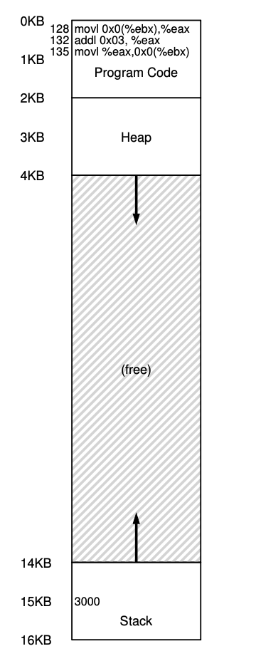

In reality, all virtual addresses accessed by the program are **translated into physical addresses by the MMU.**

The logical segments above could be in entirely different physical pages in memory — e.g., the heap might span multiple non-contiguous pages in different physical locations of RAM, as decided by the operating system. 

## Paging

The operating system divides the address space into **fixed-size units called pages.**
Physical memory is thus an array of fixed-size slots called **page frames**, each of which can contain a single page. 

The virtualized address space of each program, in these terms, looks like an array of pages, starting from index 0:

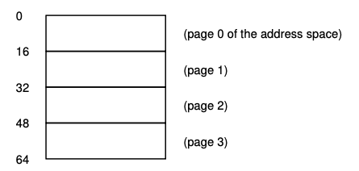

Each *virtual page* maps to a real, *physical page frame* in memory:

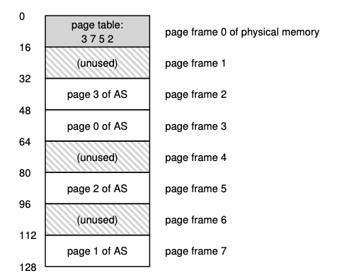

### Page Tables

To facilitate this abstraction, the OS stores a **per-process page table** in main memory, which stores **virtual-to-physical address translations.** 

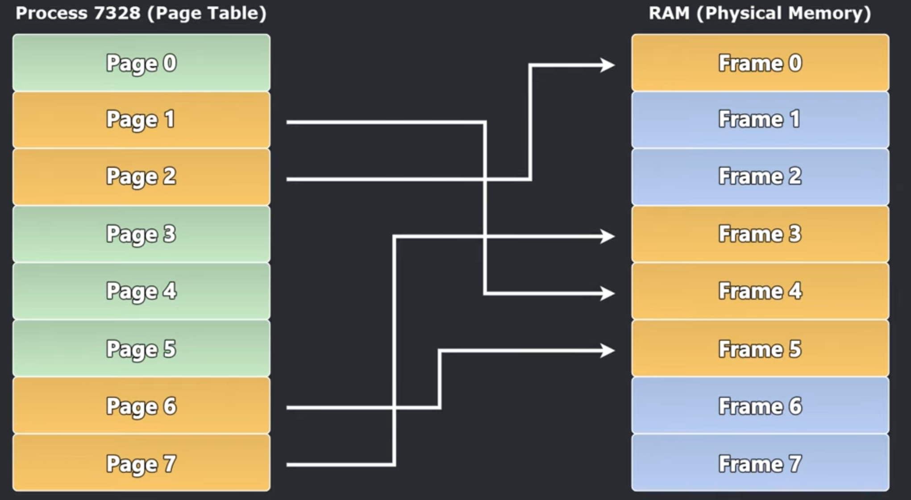

When the user program tries to access memory residing in a virtual page, the *hardware* (specifically, the MMU) looks up the virtual page number (VPN) and translates it to the physical page frame number (PFN). 

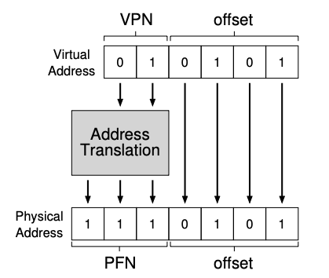

In its simplest incarnation, the page table is just a linear page table, a flat array holding entries for PFNs and indexed by VPNs.

The size of the page table is:

$$
\frac{\text{size of address space}}{\text{size of page}} \times \text{size of page table entry}
$$

E.g., for a 32-bit system (addressable space of $2^{32}$ bits = 4GB, ignoring space for the kernel itself) with 4KB pages and
4 byte page table entries, the first term (i.e., the number of virtual pages) is 1,000,000, resulting in 4MB per page table.
Note the naive linear page table [<em>must contain the maximum addressable virtual space</em>, even if the process doesn’t use most of it]{"Without the full range of VPNs, direct indexing (and therefore fast lookups) wouldn't be possible."}. 

(This is wasteful, and will lead us to multi-level page tables described below). 

#### Page Table Entries

Each page table entry (PTE) needs to store, in addition to the PFN, some other useful information.

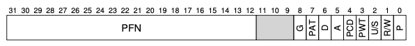

&rarr; **Present (valid) bit:** this tells us whether the page has a physical frame in memory. A present bit of 0 can mean that

- the page was swapped to disk,
- the page was allocated but not yet used (due to demand paging),
- the process did not allocate the page (i.e., accessing it would be an error).

If the hardware sees a present bit of 0, it will often trap into the OS, who is responsible for determining which of the above cases it is dealing with (typically by way of the VMA, discussed later).
This enables a sparse address space (demand paging); if most pages are invalid (e.g., when the process starts up), they don’t actually need to be backed by physical memory.

&rarr; **Protection bit:** this indicates page permission: e.g., read-only, read-write, executable. For instance, pages holding data should almost never be executable to arbitrary code execution attacks, but pages holding program instructions obviously should be. As a rule, pages are typically either *writable or executable, but never both*. 

&rarr; **Present bit:** this tells us whether the page is in physical memory or on disk (has been swapped out). 

&rarr; **Dirty bit:** this tells us whether the page has been modified, and needs to be re-written to its copy in swap space on the disk later (or, if it is file-backed, whether it needs to overwrite its backing copy on disk).

&rarr; **Reference bit:** this stores whether a page has been accessed, and is used for the page replacement policy for swapping, e.g., to implement an LRU eviction policy.

&rarr; **Global bit:** this is set for pages that are globally shared among processes. Typically, [kernel pages have a global bit of 1, since they do not change during a context switch.]{"Jumping ahead, note that kernel pages sticking around in the TLB can crowd out program pages, causing TLB pollution. There are mitigating strategies, e.g. using huge pages for kernel pages, or a fixed ('wired') set of entries specifically reserved for the kernel."}.

&rarr; **U/S bit:** this stands for user/supervisor bit, indicating whether the page can be accessed by user-space programs, or whether it requires kernel mode (again, kernel pages typically have a U/S bit of 0, where 0 is supervisor). 

#### Anonymous vs. File-backed Pages, and the Dirty Bit

Let's briefly define a little bit of page terminology, and understand interaction with the dirty bit.

**Anonymous pages** are those that have no backing page on disk (e.g., pages in the heap or stack). If they contain data (dirty bit == 1), they *must* go to a swap file if they are evicted, to ensure the data is not lost (or if they are already in swap space, the page in swap space must be updated). If they have a dirty bit == 0, they can be safely discarded upon eviction. 

**File-backed pages** are those that have a backing page on disk (e.g., code, mmap’ed files). If these are clean (dirty bit == 0), they can be safely discarded during eviction, since they can always be re-read from the backing disk location. If they are written-to (dirty bit == 1), the backing location needs to be overwritten. 

There are two scenarios where we have an *anonymous page* with a *dirty bit of 0*. 

1. Newly allocated page. Any memory that has been malloc’ed but not written to (initialized) is mapped to the **zero page**, a <em>special, read-only page frame</em> that is [permanently filled with zeroes]{"This is for security — it ensures malloc’ed memory points to nothing. E.g., if a malicious process tried to read a newly malloc’ed memory region, it wouldn’t read some other program’s data."}. Many processes may unknowingly 'share' the zero page — this is another way the OS saves space.
2. Freshly swapped page. A page that was previously evicted (and written to swap space), and then brought back into main memory, will have a dirty bit of 0: it is a perfect copy of the corresponding page in swap space. 

#### Page Sharing

For efficiency, physical page frames are often shared between processes. For instance, the zero page, as we just saw.

Copy-on-write, a self-describing mechanism, is also used frequently by the OS for efficiency. For instance, when a child process is forked from the parent, the entire page table is copied, and all the pages are set to read-only; only upon a write does the OS need to duplicate the underlying frame.

Shared code segments (such as shared .so libraries) are used by many processes, and are safely shared from a single set of pages, since code is typically read-only + executable.

Finally, processes can of course opt-in to page sharing via `mmap` to share the same physical page for, e.g., shared-memory IPC. 

The OS will actually perform page deduplication (kernel same-page merging, or KSM), where it will find different physical frames and quietly merge them (marking them as copy-on-write).

### Translation Lookaside Buffers (TLBs)

For every memory lookup made by a program, paging effectively means that we perform *two* memory lookups — in addition to the data itself, we also have to do a page table lookup (which itself is also stored in main memory) to find the physical page frame holding the data. This effectively doubles the memory latency.

The **Translation Lookaside Buffer** is a cache of frequently used virtual-to-physical address translations stored in the hardware (part of the memory management unit, or MMU). The idea is that most lookups will hit the TLB, and only rarely must the hardware perform a page table walk. 

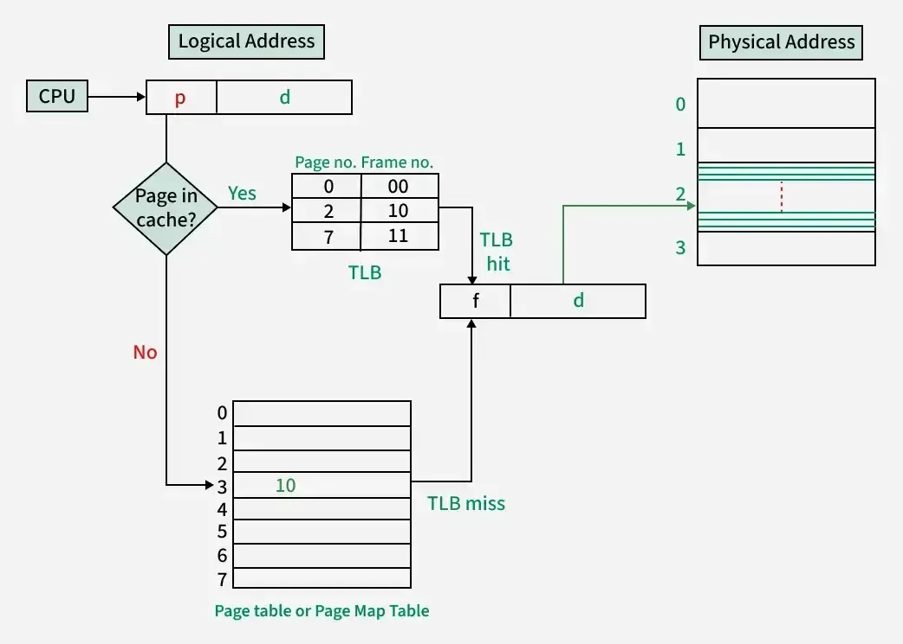

Like CPU data caches, the TLB is stored much closer, directly on the CPU (and like the CPU cache, uses SRAM instead of DRAM), resulting in much faster lookups. 

Modern operating systems have [<b>hardware-managed TLBs</b>]{"I.e., the hardware is responsible for handling the TLB miss, including walking the page table."}. The hardware stores a *page-table base register* in a special hardware register, pointing to where in main memory the page table is located. 

On a TLB miss, the hardware walks the page table, finds the page table entry, puts the entry into the TLB, and retries the instruction. 

#### TLB Structure

The TLB is typically fully-associative (any page table entry can map to any cache entry). This way, the hardware searches the entire TLB in parallel. 

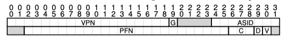

Like the page table, each TLB entry stores the VPN, the PFN, and additional bits. The additional bits must include the exact same **protection** and **U/S** bits of the PTE, to enforce the same permissions. It also includes the same dirty bit (and must sync this back to the PTE) and the same global bit. 
It also has two main additional bits:

&rarr; **Valid bit:** this indicates whether the page has a valid translation. All entries are marked invalid on kernel startup, and valid only when populated by a page table fetch.

&rarr; **Address-space identifier (ASID):** this is much like the process identifier (PID) and tells us which address space the page comes from. This enables sharing between processes, as we will see, during context switches.

Note that the TLB does not have a present bit — the TLB only stores pages in RAM; if the page were on disk, it would trigger a page fault before reaching the TLB. Nor does it have an accessed bit — the fact that a page is in the TLB means it has been accessed.

#### Context Switches

Page tables are per-process structures — many processes may have colliding virtual page numbers, since they all want to pretend that their address space starts at index 0. 

This means that TLBs, if implemented naively, are only valid for the currently running process.

Here is where the ASID earns its keep: we can have two TLB entries with identical VPNs, so long as we know 1) which process each entry belongs to (via the ASID), and 2) the currently running process (via a hardware register set by the OS). 

This way, the TLB simply needs to look at the current PID; if it sees two conflicting VPNs, it knows which translation to use based on the ASID. The benefit is that the TLB can retain cache entries across back-and-forth context switching, rather than needing to be flushed every time.

#### Coherence

Unlike data caches, TLBs in multi-core systems do not typically have a cache coherence protocol (e.g. MSI + bus snooping). TLB misses occur far less frequently than cache misses, since page table entries are rarely changed; thus, TLB coherence uses a simple, heavy-handed approach: the **TLB shootdown.**

**TLB shootdowns** often occur between threads, since threads share the same exact page table. Here's a scenario.

Say thread A (on core 1) frees a page that is in thread B’s TLB (on core 2). After thread A updates the PTE in main memory, the OS needs to detect the change and tell thread B that it's TLB entry is now garbage. The OS sends an inter-process interrupt (IPI) to thread B on core 2, asking it to flush that specific entry in the TLB cache. 

How does the OS know it needs to send a message to core 2? The kernel stores a `cpu_mask` in the kernel’s per-process `mm_struct`, which is a bitmask indicating which cores are in use by the process.

Another case requiring a TLB shootdown is if the kernel itself updates its own kernel page, in which case it must issue a global shootdown to all cores to invalidate any kernel TLB entries. 

### Multi-level Page Tables

We mentioned earlier how linear page tables result in lots of wasted space (particularly, for all the virtual addresses that aren’t at all accessed). 

The multi-level page table enables a much sparser page table structure. The idea is to chop up the page table into page-size units (e.g., for 4 byte PTEs and 4KB pages, 1000 PTEs per page). If an entire page of PTEs is invalid, the whole page is invalid, as marked in a **page directory.**

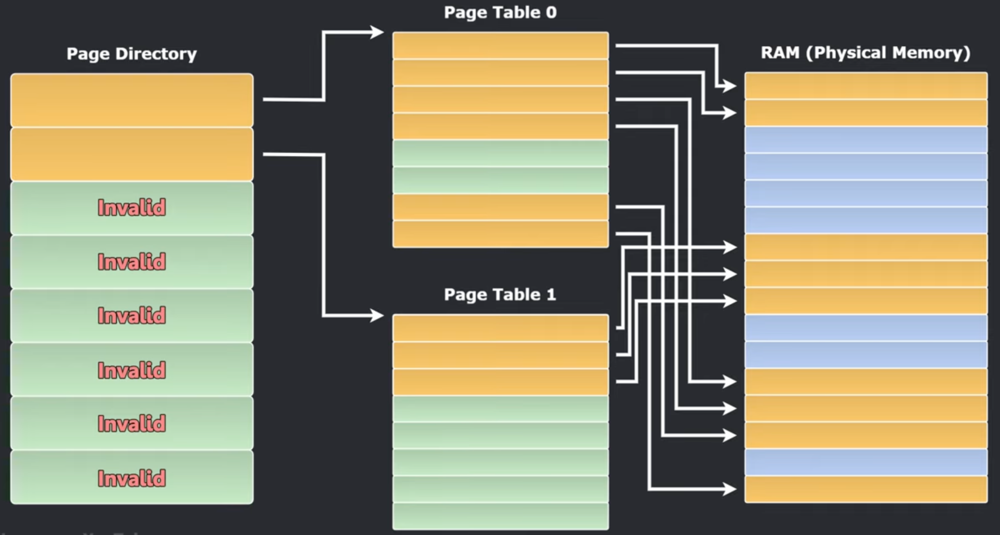

The page directory tells you either *where a page of the page table is*, or that the *entire page of the page table contains no valid pages*.

The multi-level page table is a **time-space tradeoff**. The time tradeoff is that we require an additional lookup for each level of indirection, resulting in greater lookup latencies. It also introduces more complexity into the lookup instructions (either in the hardware or OS). 

The space tradeoff is that we use far less memory (proportional only to the amount of address space in use). It also makes the allocation of the page table itself more flexible: whereas a linear page table needs a contiguous memory space (since it is an array), the pages of a multi-level page table can be placed throughout physical memory as needed. 

#### Multi-level Lookups

To enable multi-level lookups, the bits of the virtual page number are split to index into each level of the page directory. 

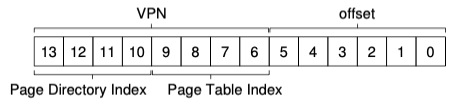

E.g., in a two-level page table where the page directory has 16 entries, 4 bits of the VPN are used as the **page-directory index**, which determines its page in the page directory (PD).

This, multiplied by the size of a PTE, is added to the base page directory index (stored in a special per-process register) to index into the page directory, retrieving the page directory entry (PDE). 

The remaining bits of the VPN are the offset into the second level, i.e., the page table itself. Here we get the PTE which actually contains the desired PFN.


```python
# Drop the bottom 10 bits, leaving only the Page Directory index
PDIndex = VPN >> 10
# Isolate the bottom 10 Page Table bits
PTIndex = VPN & 0x3FF 

# Locate the Page Directory Entry (PDE)
PDEAddress = PDBase + (PDIndex * sizeof(PDE))

# Locate the Page Table Entry
PTEAddress = (PDE.PFN << PAGE_SIZE_SHIFT) + (PTIndex * sizeof(PTE))
```

In a system with larger virtual address spaces (e.g., 64-bit systems), two levels might not be enough: the page directory itself may not fit in a single page, because there are too many pages required to store all the PTEs. In such a case we introduce more levels:

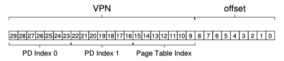

In the three-level page table, we now have two levels of page directories, requiring three fetches on a page table lookup. (And we see why TLBs are so bad!) 

#### Huge Pages

Some systems allow a process to ask for a **huge page** (a single page typically around 2MB to 1GB+). The benefit is that a single PTE is used for a much larger region of memory; e.g., far fewer TLB slots can service a much a larger amount of memory. 

The TLB miss path is also faster for a huge page — fewer levels of the page table need be traversed during a page table walk, given the page is many thousands of standard pages.
In other words, a huge page can be identified via a much coarser page directory identifier (i.e., fewer bits) since it occupies a larger range. 

> Aside: An ideal use case for huge pages is the DBMS, which stores a database index that is large and randomly accessed (thus it can make much better use of the TLB, and the initial demand-paging lag is far shorter). 

Huge pages do have drawbacks: one is internal fragmentation, where the page is allocated but sparsely used (thus memory is wasted *internal* to the allocation). [Swapping also performs poorly with huge pages, given the much amplified disk I/O]{"For this reason, huge pages are typically in pinned memory (i.e., cannot be swapped), a rule sometimes enforced by the OS."}. 

### Swapping to Disk

We have alluded to page swapping quite a bit already, and here we will discuss it in more detail. 

The OS reserves a portion of disk for **swap space** (often 1-2x the size of main memory) to swap pages in and out of memory. This provides an illusion of a much larger main memory, under the assumption that only a smaller portion of total addressable memory is actively needed by the CPU at a given time (i.e., like all caches, the assumption of spatial/temporal locality). 

#### Page Fault Control Flow

Recall the **present bit** tells us whether a page is in physical memory or has been swapped to disk. When the hardware sees `present == 0`, it immediately throws a **page fault**, and traps into the OS page fault handler.

The page fault handler must disambiguate the reason for the page fault:

- (1) the page is in swap space on disk,
- (2) the page was allocated but has no page frame (due to demand paging),
- (3) the process did not allocate the page (i.e., accessing it would be an error).

The OS first checks case (3) by performing a lookup in the VMA (discussed later). If it is illegal — the VPN is not in any VMA boundary — the OS throws a segfault. 

For entries with `present == 0`, note that the PFN is meaningless to the hardware. The OS is smart, and takes those otherwise unused bits to store the **disk address**, if the page was swapped. 

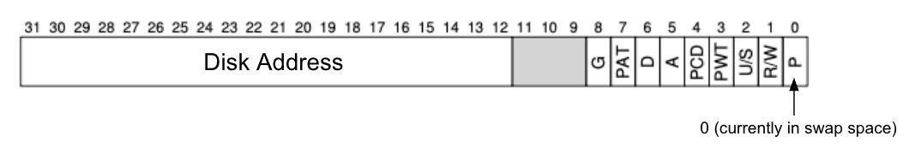

This way, the OS distinguishes case (1) and (2) by looking at the PFN. If the PFN bits are all zero, the OS will simply point the PTE to the zero page (for a read) or allocate a fresh physical frame (for a write). If the PFN bits contain a disk address, the OS issues a disk fetch to load the swapped page back into memory. 

After a disk fetch, the OS updates the PTE with `present = 1`, and updates the PFN to record the in-memory location of the newly-fetched page. It then *retries the* *page fetch*. (The page fetch retry may trigger a TLB miss, which would follow the standard TLB miss path to update the TLB with the translation). 

#### Free Space Management

For efficiency (and to avoid thrashing), the OS will not wait until memory is entirely full to evict pages. To keep a small amount of memory free, the OS has a **high watermark (HW) and low watermark (LW).** 

When the OS notices there are $< LW$ page frames available, a background thread (the *swap daemon*) swaps pages to disk until there are $\ge HW$ page frames available in main memory. (The gap between $LW$ and $HW$ determines how often the swap daemon runs). 

#### Eviction: Clock Algorithm

If the OS fetches a swapped page from disk, it may need to evict an existing page to make space. The most common eviction policy is **LRU.**

The problem is that *exact LRU is expensive to implement*. Exact LRU would require storing accessed pages in some data structure (e.g., a linked list). Upon *every memory reference*, the reference page would need to be moved to the front of the list.

LRU can be approximated via the **clock algorithm**. The idea is:

$$
\text{Rotate through pages until we find one that hasn't been}\\ \text{ referenced since the }\textit{last time}\text{ we checked it.}
$$

This makes use of the **reference bit**, which recall, is set to 1 when a page is accessed.

First, the hardware stores a pointer (”clock hand”) to a particular page table entry — initially, it does not matter which. When a page needs to be evicted:

- The hardware iterates over the page table entries, in order (rotating back to the start if it reaches the end).
    - If it sees `present == 1` , it sets `present = 0` , marking the page as un-referenced, and advances the clock hand.
    - If it sees `present == 0` , it chooses this page to evict, advances the clock hand once more, and stops.
- The clock hand positions is remembered for the next run.

In effect, a page can “save itself” by being referenced between evictions, and hence recently used pages end up staying in memory.

### Virtual Memory Areas (VMAs)

The OS keeps additional memory-related bookkeeping, beyond that of the page table, in its kernel space. These are the `mm_struct` and, within it, the `vm_area_struct` .

#### Memory Descriptor

The OS stores a **Memory Descriptor** (known in Linux as the `mm_struct`) for every process. 
The memory descriptor contains:

- Pointers to the process’s highest-level page directory (so the hardware knows where to start the page table walk)
- The start and end virtual addresses for memory segments (e.g. code, heap, stack)
- A data structure holding all the distinct virtual memory regions (VMAs) making up the process address space

#### Virtual Memory Areas

The **Virtual Memory Areas** (stored in Linux as the `vm_area_struct`) stores all the VMAs for a process. Each VMA is a *single contiguous block of virtual addresses* with the *exact same permissions and backing store.* It is created upon each `mmap` call issued from user-space.

E.g., for a running process, its stack is a VMA, its heap is a VMA, and the shared C .so library is a VMA.

The VMA enables **demand paging**. When a process makes an allocation request, the OS simply allocates or extends a VMA (effectively, “giving” this range to the process). During this phase, the OS can coalesce adjacent VMAs (barring permission differences) for efficiency.

The VMA is also used during **page fault disambiguation**. The OS searches the VMA search tree (implemented as a [red-black or maple tree]{"See https://docs.kernel.org/core-api/maple_tree.html"}) to find the faulting virtual address and determine if the address is in a valid VMA. 

#### Virtual Address Segments

The start/end addresses for memory segments look something like this:

- `start_code` and `end_code`
- `start_data` and `end_data`
- `start_brk` and `brk`  (start and end of heap)
- `start_stack`

The primary usages are for interaction with the software memory allocator. E.g., when `malloc` needs to extend the heap, it can first extend the `brk` bound, and *only if it crosses a page boundary* does it need to adjust the underlying VMA. 

## Software Memory Allocators

Free space at the OS/hardware-level is simple: the hardware has fixed-size pages that it allocates and deallocates. 

But free space needs to be managed at the **user-level** (virtual address space) by the software memory allocation library (e.g., malloc). This prevents *virtual fragmentation*, where there isn’t a large enough contiguous segment of *virtual addresses* to store a piece of memory. (After all, we need to make sure the addresses *look* contiguous for pointer arithmetic, etc.). 

`malloc` needs to speak in terms of virtual pages to the OS, while providing the illusion of variable-sized memory segments to the user.

It uses a **free list**, describing the free space remaining in the heap.

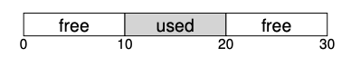

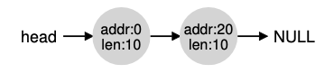

### Free Space Management

**Splitting**

Say we want to allocate an additional 1 byte. 
`malloc` will *split* one of the free segments (size 10) into two chunks of size (1, 9).
The first will be returned to the caller, the second will remain on the list.


**Coalescing**

Say we want to free the 10 byte segment in the middle of the heap.
When we return the free chunk to memory, `malloc` will look at the nearby chunks of free space and merge free chunks together into larger chunks.

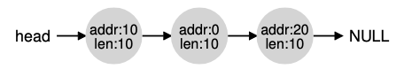

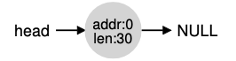

### **Embedding the free list**

The free list itself needs to be stored in memory. It is represented as a linked-list across **memory headers.** The memory headers store the size (and a magic number - used for runtime integrity checks) for each allocation.

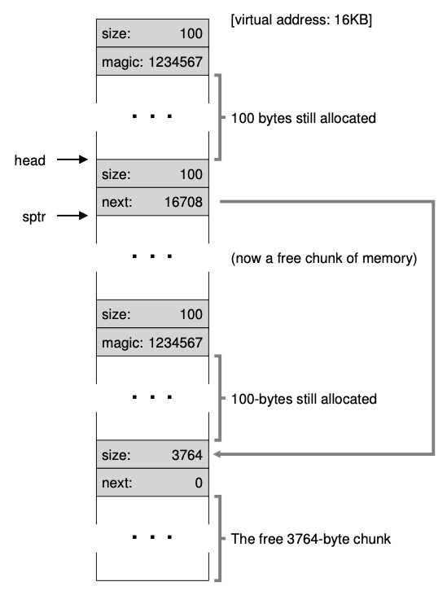

Free chunks have a slightly different memory header, with a `next` pointer to the next free chunk. There is a single global pointer to the first chunk in the free list (stored in static memory).

### Bridging Segments and Pages

`malloc` is manipulating variable-sized segments. In reality, these segments might be crossing virtual page boundaries.

At the very beginning of a program, `malloc` will make a single syscall (e.g., `mmap`) to reserve some initial set of virtual pages, covering the virtual address space for the program. 

Note, of course, this isn’t *actually* allocated to the program due to demand paging; this particular `mmap` call is *anonymous* since there is no backing store in the filesystem. All it does is tell the OS to store the requested range in the VMA.

Only upon a page fault (the program writes to the virtual page) will the OS go and find a real physical page. (This differs from memory-mapped files, which actually have a physical backing store mapped into the virtual address space.) Before then, the page table entries for all of these initial virtual pages are still invalid.

#### Negotiating in terms of Pages

When `malloc` needs to grow the heap beyond the initial `mmap` ’ed region, it will need to request more memory. In this case it needs to **round up** its requests to the nearest multiple of the page size. 

When `malloc` needs to return memory to the OS, it can only return fixed-size pages. So after coalescing the free chunks, `malloc` needs to determine the virtual page boundaries. It has to figure out if the memory it has freed actually releases entire page(s), and if so, return this to the OS using `madvise`.

### The Heap vs. Stack

The difference between the heap and the stack, from a programmer’s point of view, is apparent when we put the pieces together at the `malloc` layer. 

To the OS and hardware, stack memory and heap memory are identical. Both are just 4KB virtual pages mapped to scattered physical frames. The difference is in the allocation strategy that `malloc` can use. 

#### **The Stack**

The stack uses a **bump allocator** — i.e., every stack allocation is just *pointer arithmetic* to move the stack pointer. (Subtract 8 bytes from the stack pointer to allocate an `uint8_t` , add 8 bytes back to the stack pointer to deallocate). 

Because the stack only moves in a straight line, the stack moves over the exact same set of contiguous virtual pages, which `malloc` can reserve up front. 

Thus stack usage operates like a **high-water mark**. We reserve a number of pages upon process startup for the stack (e.g. 8MB, or 2048 pages). As the stack starts allocates memory, the OS actually goes and finds physical page frames for the stack via demand-paging. But when that memory goes out of scope, it is *never given back* to the OS. 

So in addition to very fast allocation, this means that stack memory is always mapped directly to physical pages, so we never run in to page faults (beyond the initial cold misses). 

#### **The Heap**

The heap is what requires free space management described above, needing a free list and a splitting/coalescing process.

`malloc` needs to look at the global head pointer and walk over the free list to find a free chunk that fits the allocation. Similarly, it needs to do coalescing and give pages back to the OS upon deallocation. 

Heap paging is random by nature, since `malloc` is hopping over virtual memory space to find free chunks, and frequently accessing *cold, unmapped virtual pages*, such that the OS needs to frequently page fault and map new physical pages. 

## Inter-Process Communication

When we put everything in terms of pages, inter-process communication (IPC) is actually not so scary. We know fundamentally, all data exchange needs to boil down somehow to physical pages. 

Thus, we can oversimplify by saying:

- All IPC boils down to either
  - (1) two processes **sharing the same physical page** (*direct access*), or
  - (2) two processes writing to distinct pages with communication mediated by the OS kernel (*buffered access*).
