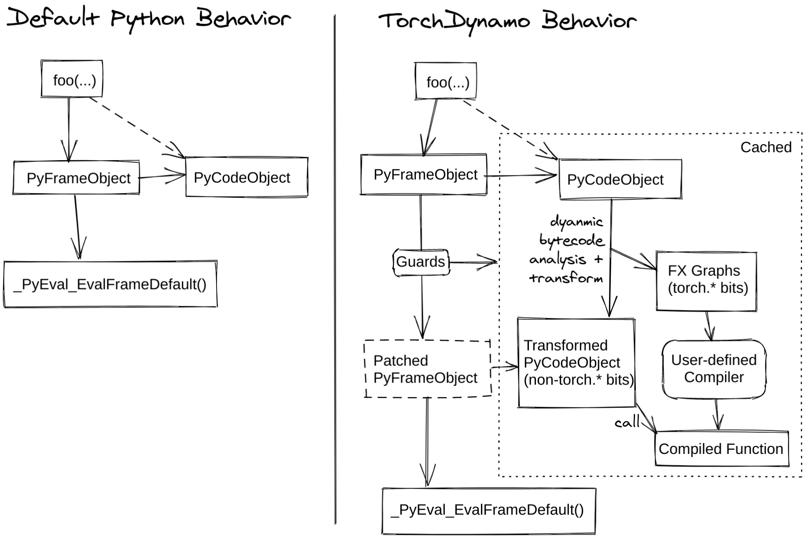
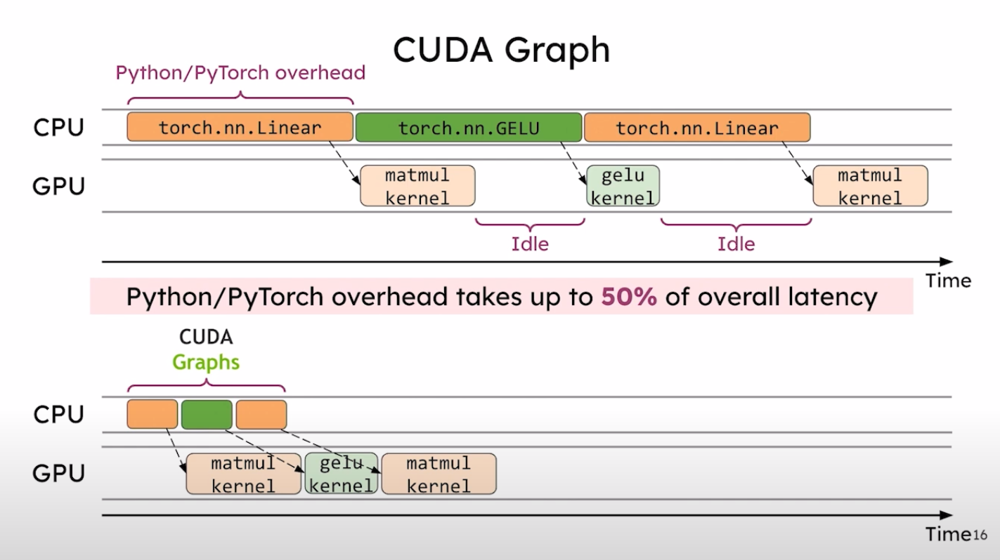

# Torch Compiler

## Contents

1. TorchDynamo (Tracing)
2. TorchInductor (Compiling)
3. CUDA Graphs (Kernel Fusing)

## High-Level

1. Extract computation graph.
    - **Dynamo** traces function into an FX Graph
2. Compile graph into optimized functions.
    - **Inductor** compiles the FX Graph into efficient Triton kernels
3. Assemble into a new function.
    - Bytecode of the function is rewritten to call the compiled function
    - Give function to CPython to run it
4. Capture CUDA graphs.
    - Record sequence of kernels (stream) invoked by compiled function
    - Group kernels that can be launched together (this is a CUDA graph)

# 1. Torch Dynamo

### Process

1. Dynamo traces function into an FX graph.
    1. Pass the FX Graph to **Inductor** to compile into efficient kernels.
2. Rewrite the bytecode of the function to call the compiled function.
3. Give CPython the new bytecode to run.

### Tracing

**Dynamo is a tracer.** Given function and inputs → returns FX graph.

**→ What’s an FX graph?** Basically, a container storing a list of function calls. 

**→ What’s tracing?**

Follow a dummy input through the function, record linear sequence of PyTorch operations (DAG).

- Linear = no branching/control flow - only store the part of the if statement that was executed.
- Treats all non-tensor variables as constants (”specializes” these values).
    - When a different shaped input enters, we retrace to create a new graph.
- Symbolic shapes: avoid retracing by marking an integer as dynamic (e.g. batch size).

### Frame Evaluation

**How is it implemented?**



**PEP523:** Frame evaluation API

- User can add custom per-function interpreter, which CPython will use for the function
- CPython provides custom interpreter with function bytecode, argument values, names

**Dynamo + PEP523:**

- Dynamo = custom Python interpreter that runs the code and records the PyTorch operations
    - Call the backend (**Inductor**) to optimize the sequence of operations (graph)
- Packs the bytecode of the operations into a Python structure (VariableTracker)

### Guards

**Problem:** So what do we do about control flow? Tracing works if program is linear.

**Guard:** assumption made in order to specialize a frame for a set of inputs.

- Graph can only be reused if assumption holds on new inputs
- Accumulated during building phase (VariableTracker) and during execution

### Symbolic Shapes

Dynamo assumes static by default (no integers will be traced). 

- If it detects a shape/integer changed, it will trace and generate a graph generic (SymInt)
- Duck shaping: if two dynamic integers have the same trace value, assume they are equal and guard on it (allows compiler fusions)

This is why we need a custom interpreter.

- Example:

```python
@torch.compile(dynamic=True)
def fn(a):
    if a.shape[0] * 2 < 16:
        return a
    else:
        return a + 1

fn(torch.randn(8))
```

- Guard: `2*L['a'].size()[0] >= 16`
- Cannot know this guard is needed until we get to the conditional on the symbolic argument
- Requires analysis of the Python bytecode

### Graph Breaks

**How to handle “arbitrary Python code”** (async, coroutines, external libraries, etc.)?

**Graph break:** generate multiple graphs (before and after problematic code)

- Delegate problematic code to CPython at runtime using CPython’s frame evaluation API

For code that is (graph1, problematic code, graph2), it returns:

1. Bytecode that executes the first graph
2. Bytecode that leaves the stack as it would be if CPython would have executed the first graph (replays modifications to local or global variables)
3. Bytecode that made Dynamo graph break (raw problematic code)
4. Bytecode that executes the second graph

# 3. Torch Inductor

**How do we compile the FX Graph that Dynamo traces?**

### Graph Lowering

Lower the FX graph into a **fine-grained IR** (intermediate representation).

- Keep track of tensor operations / memory access patterns.
- Fuse together tensor computations to avoid unnecessary reads / writes.
    - e.g., fuse `y = x * 2; z = y + 3` → `z = (x * 2) + 3`
- **Symbolic shapes:** Use SymPy to track symbolic shapes
    - Track the symbol through the entire program
    - Memory accesses represented as symbolic indexing formulas dependent on inputs
    - Create guards for assumptions on input shapes, trigger recompilation if guards fail

### Graph Compiling

Fuse together kernels for tensor operations. 

- Original kernels: `kernel_1: sin(x)  ->  kernel_2: mul(x, 2)  ->  kernel_3: add(x, 1)`
- Fused kernel: `kernel_fused: result = (sin(x) * 2) + 1`
- Generate Triton code for PyTorch operation kernels.
    - Optimized thread-block scheduling / block-wise memory access
    - Triton code gets JIT compiled into efficient PTX / CUDA binary (cubin) code

This compiled Triton code is returned to Dynamo (and cached for subsequent runs).

The bytecode of the original function is modified by Dynamo to **call the compiled kernels.**

# 3. CUDA Graphs



**Problem:** CPU kernel launch overhead is inefficient.

- CPU launches creates gaps between kernels where GPU is idle

Inductor has already fused together CUDA kernels at the **IR level** to make them more efficient.

- This is a **compile-time** optimization.
- But there’s still idle time between those kernels! We can still make **run-time** optimizations.

**Solution:** Capture sequences of kernels as CUDA Graph.

- Spend a fixed amount of time building CUDA graph at initialization
- At runtime, we can launch multiple kernels with a single CPU operation (minimal idle time)

**How?** Using CUDA Stream capture.

- Create a graph from a section of code that launches work into streams
    - Instead of enqueuing work for execution, append to a graph
    - Progressively build graph of kernel operations (without argument setup / kernel dispatch)

We can create many such graphs to t