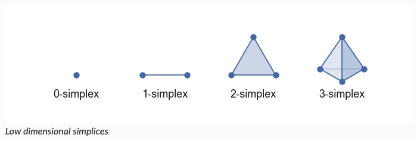
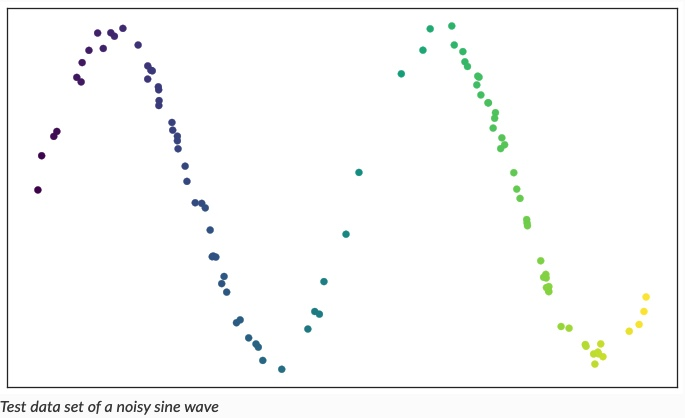
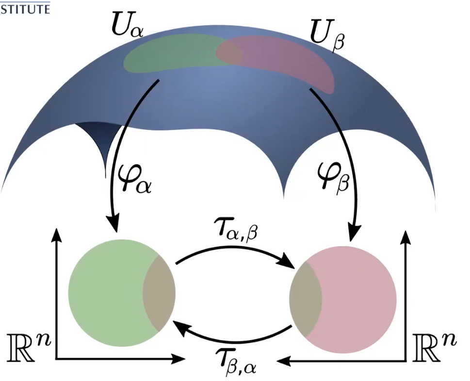

# UMAP

From ["How UMAP Works"](https://umap-learn.readthedocs.io/en/latest/how_umap_works.html) by Leland McInnes.

## High-Level

1. **Graph Construction**
    1. Construct weighted K-NN graph.
    2. Transform edges to approximate local distances.
    3. Deal with asymmetry between local notions of ‘distance’. 
2. **Graph Layout**
    1. Define objective function that preserves characteristics of K-NN graph. 
    2. Find low-dimensional representation of data optimizing objective.

---

# 1. Graph Construction

## 1a: Construct weighted K-NN graph

**Simplex**: high-dimensional triangle.

**Simplicial complex**: set of simplices glued together along their faces.

We can build up a simplicial complex from a topological space.

Given data:

…we can create an open cover (fixed radius balls around each point):

.jpg)

…then we create simplices from this cover (called a Čech complex):

- Let each set in the cover be a 0-simplex.
- Create a 1-simplex between two sets if they have a non-empty intersection
- Create a 2-simplex between three such sets if the triple intersection of all three is non-empty
- …etc
    
.jpg)
    

**Nerve Theorem.** Basically, this simple structure preserves the important characteristics of the topological manifold.
Particularly, this structure is a **homotopy equivalence** to the original data space (i.e., we can transform one into the other through bending, shrinking, and expanding).

---

## 1b: Transform edges to approximate local distances

**Problem:** in the picture above, the representation isn’t perfect—there are gaps and clumps. 

- …why? Because the data wasn’t uniformly distributed on the manifold!

**Assumption: a**ssume the data is uniformly distributed on the manifold.

- Define a **Riemannian Metric** on the manifold to make this true.

**Riemannian Metric:**

**Idea:** Patches on the manifold *map down to euclidean spaces on different scales.*

- Different notion of ‘distance’ depending on which patch you are in.
- Glue together these patches to make up the manifold.

**In practice:**

- Each point has its own local notion of distance
- Unit ball about a point stretches to *k*-th nearest neighbor of the point, where *k* is the sample size we are using to approximate the local sense of distance

After applying the Riemannian metric:

Great! We’re better covering the manifold!

Choosing hyperparameter `k`*:*

- Small *k*: very local interpretation, capture fine detail structure of the Riemannian metric
- Large *k*: estimate based on larger regions; miss some of the fine detail structure, but more accurate across the whole manifold (more data to estimate with)

But why choose a fixed radius, a binary “yes” or “no” for membership to a simplicial set?

Instead, we can use **fuzzy sets**:

.jpg)

Now the confidence that a neighboring point belongs to a set ‘decays’ as we get further away. 

**Assumption: w**e will also assume that points are locally connected:

- Fuzzy set confidence decays only *beyond the first nearest neighbor.*

Why? Curse of dimensionality:

- In very high dimensions, all distances start to look similar (1st neighbor distance and 10th neighbor distance look relatively similar).
- Local connectivity constraint ensures we focus on *relative distances* (vs. absolute distances)
    
    .jpg)
    

---

## 1c: Deal with asymmetry between local notions of distance

**Problem:** our local metrics are not compatible!

.jpg)

There are multiple edges between any pair of points due to different notions of weights.

**Solution:** Take the **fuzzy union** between these fuzzy simplicial sets.

$$
f(\alpha, \beta) = \alpha + \beta - \alpha \cdot \beta
$$

If we union together all the fuzzy simplicial sets, we end up with a single fuzzy simplicial complex:

Basically, just a weighted graph, but with strong mathematical foundation :).

---

# 2. Graph Layout

## 2a: Define objective function preserving graph characteristics

Now, we have a **fuzzy topological representation** of the data.

How do we embed the data?

- we *know* the manifold (low-dimensional euclidean space, e.g. $\mathbb{R}^3$)
- we *don’t know* the correct nearest neighbor distance (where to embed the graph)

**Optimization:** find the low-dimensional representation that “best matches” the fuzzy topological representation.

Cross-Entropy Loss:

- $w_h(e)$ = weight in high-dimensional case
- $w_l(e)$ = weight in low-dimensional case

**First term:** $\sum_{e \in E} w_h(e) \log(\frac{w_h(e)}{w_l(e)})$

- “Get the clusters right” (attractive force)

**Second term:** $(1- w_h(e))\log(\frac{1-w_h(e)}{1-w_l(e)})$

- “Get the gaps between clusters right” (repulsive force)

`min_dist` : minimum distance between points in low-dimensional space. 

- small value: more tightly packed embeddings—focus on clustering, fine topological structure
- large value: more loosely packed embeddings—focus on broad topological structure (softer, more general features)

---

## 2b: Find low-dimensional representation optimizing objective

Now we have a **fuzzy topological representation** of the data, and an objective function that defines the **best low-dimensional embedding for the representation.** 

Use SGD to optimize the low dimensional embedding according to cross-entropy.

**Computational tricks:**

- Compute approximate nearest neighbors (NN-Descent)
- Make the objective function differentiable
    - Use a smooth approximation of the membership strength
- Instead of dealing with all possible edges, use negative sampling
    - Randomly sample edges to act as “dissimilar” examples
- Use spectral embedding to initialize the graph in a good state